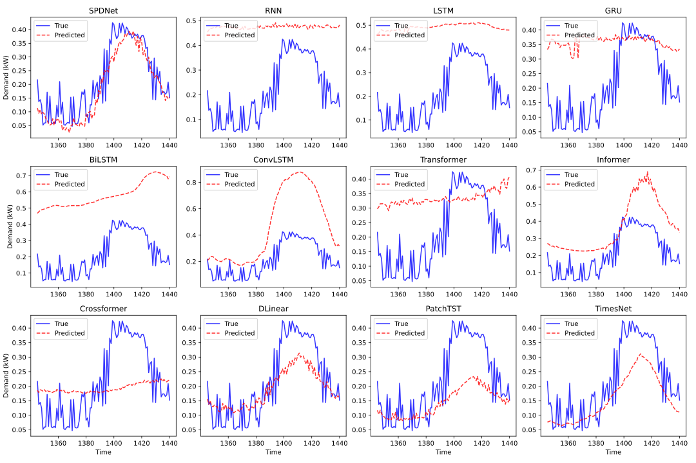

# SPDNet: Seasonal-Periodic Decomposition Network for Advanced Residential Demand Forecasting
Our paper is available on arXiv:**
https://arxiv.org/abs/2503.22485\\ **
**SPDNet** is a deep learning framework designed for **individual residential electricity demand forecasting**. The model effectively captures intricate temporal variations, including multiple seasonalities, periodicities, and abrupt fluctuations, using **Seasonal-Trend Decomposition Module (STDM)** and **Periodical Decomposition Module (PDM).**

## 📌 Performance Comparison

<p align="center">
  
</p>
<p align="center"><i>Forecasted and actual electricity demand for Load 1 at sequence length S=96 and prediction horizon P=96. Legends are shown only in the first subplot for clarity.</i></p>

## 📊 Performance Metrics

<p align="center">
  
</p>
<p align="center"><i>Performance comparison of SPDNet with baseline models in terms of MSE and MAE across different prediction horizons.</i></p>

## Table of Contents
- [Repository Tutorials](#repository-tutorials)
- [Requirements and Running](#requirements-and-running)
- [Outputs and Results](#outputs-and-results)
- [Data Set](#data-set)
- [Arguments and Parameters](#arguments-and-parameters)

---

## Repository Tutorials

### 📁 Data Provider**
This folder contains scripts for **data preprocessing** and **loading datasets** for training and inference.

#### 🔹 `data_loader.py`
- Handles dataset preprocessing for training and evaluation.
- Reads the dataset, scales the values, handles missing data, and prepares sequences for forecasting.
- Implements **time encoding** to include time-based features in the dataset.

#### 🔹 `data_factory.py`
- Selects and loads the appropriate dataset class (`Dataset_Custom` or `ML_DataLoader`) based on the user’s configuration.
- Creates dataset instances and prepares **PyTorch DataLoader** for efficient batch processing.

---

### 📁 Experiment (exp)**
The **`exp`** folder is responsible for **forecasting electricity demand and selecting models** for evaluation. It contains two key scripts:

#### 🔹 `exp_basic.py`
- Defines the **base experimental setup** for different models.
- Supports multiple deep learning architectures such as **LSTM, GRU, Transformer, Informer, TimesNet, PatchTST**, and SPDNet.
- Handles **device allocation (CPU/GPU)** and model initialization.

#### 🔹 `exp_forecasting.py`
- Implements **training, validation, and testing** for different forecasting models.
- Integrates **optimizer selection, loss functions (MSELoss), and learning rate scheduling**.
- Monitors **RAM and GPU memory usage** during training for efficiency analysis.
- Supports **early stopping** and **automatic model checkpointing** to prevent overfitting.
- Generates and saves **forecasting results**, including predictions and evaluation metrics (MSE, MAE, RMSE).

---
## 📂 Models
The **`models`** folder contains various deep learning architectures used in this study. These models are responsible for learning patterns from electricity demand data and generating predictions. 

The **output** of each model is passed to `exp/exp_forecasting.py` for **training, validation, and evaluation**.

### **Implemented Models**
SPDNet is benchmarked against various **traditional, advanced, and state-of-the-art** forecasting models:

#### 🔹 **Recurrent Neural Networks (RNNs)**
- `LSTM.py`: Long Short-Term Memory network, designed to capture **long-term dependencies**.
- `GRU.py`: Gated Recurrent Unit, optimized for **faster training and reduced complexity**.
- `BiLSTM.py`: Bidirectional LSTM, processes sequences **forward and backward** to enhance feature extraction.
- `ConvLSTM.py`: A hybrid model combining **CNNs with LSTMs** to capture **spatial-temporal dependencies**.

#### 🔹 **Convolutional-Based Models**
- `CNN.py`: Captures **local temporal features** in time series data.
- `ResLSTM.py`: Integrates **residual connections** into LSTM for enhanced gradient flow.
- `Conv2DLSTM.py`: Utilizes **2D convolutions** along with LSTM layers to improve pattern recognition.

#### 🔹 **Transformer-Based Models**
- `Transformer.py`: Implements the **vanilla transformer** for time series forecasting.
- `Informer.py`: An efficient transformer variant designed for **long-sequence forecasting**.
- `Crossformer.py`: Captures **cross-dimensional dependencies** to improve prediction accuracy.

#### 🔹 **State-of-the-Art Forecasting Models**
- `PatchTST.py`: Employs **patch-based input encoding** for better handling of sequential patterns.
- `TimesNet.py`: A **period-aware** model optimized for **long-term electricity forecasting**.
- `DLinear.py`: A **linear decomposition-based** time series model with fast training.

#### 🔹 **Our Proposed Model: SPDNet**
- `SPDNet.py`: 
  - **Captures seasonality and periodicity** through the **Seasonal-Trend Decomposition Module (STDM)**.
  - **Extracts dominant periods** using the **Periodical Decomposition Module (PDM)**.
  - **Combines Conv1D, Conv2D, and Transformer Encoder** to capture short-term, intra-period, and global dependencies.

## 🛠 How Models Work
1. **Each model processes the input time series** and outputs forecasted electricity demand.
2. **The outputs are then passed to** `exp/exp_forecasting.py` for training, validation, and evaluation.
3. **The best-performing model is selected based on MSE and MAE metrics**.

---
## 📂 Layers
The `layers` folder contains essential modules that serve as **building blocks** for the models in this study.
These modules are **imported into the models** for efficient time series forecasting. .For example:
- `Conv_Blocks.py` → Called in the **TimesNet** model to process **2D tensors**.
- `Transformer_EncDec.py` → Consists of **encoder-decoder** architecture for transformer-based models.
- `Attention.py` → Defines **multi-head attention** mechanisms used in transformer-based models.
- `PositionalEncoding.py` → Provides **time encoding** to preserve the temporal order in forecasting models.

---


## 📂 Scripts
The `scripts` folder contains **shell scripts (`.sh` files)** for **defining model parameters**. For example: 

- `Conv2DLSTM.sh` → contains parameters of the **Conv2DLSTM model** for training and evaluation.

## Requirements and Running

Follow these steps to set up and run the Models.

### 🔹 **1. Recommended Environment**
- **Python Version:** It is recommended to use **Python 3.10**.
- **Virtual Environment:** Highly recommended to create a virtual environment:
### 🔹 **2. Install Required Packages**
After setting up the virtual environment, install the necessary libraries using:

pip install -r requirements.txt

### 🔹 **3. Run the Models**
- Simply **run the scripts** in a terminal using:
  ```bash
  sh ./scripts/SPDNet.sh
  sh ./scripts/Bilstm.sh

---
## 📊 Outputs and Results
The output of each experiment can be found in the following folders:
### 📂 logs
Contains:
- Hyperparameters used during training
- Real-time monitoring during training
- Final outputs of the models
### 📂 results
Contains:
- All forecasted and true values in .npy format
- Example files: pred.npy, true.npy, etc.
### 📂 test_results
Contains:
- Visualizations of the forecasting results
- Plots comparing actual vs. predicted values
---  

## Data Set
Electricity load demand data, along with weather information, are included in the `Dataset` folder.

---

## Arguments and Parameters
All model parameter definitions and arguments are provided in `arguments.py`.


